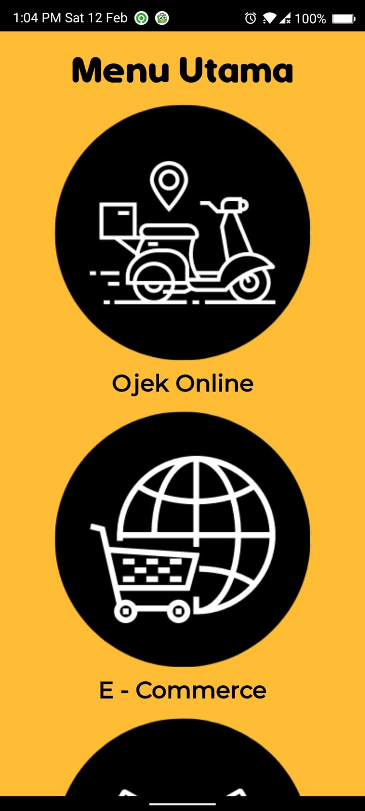
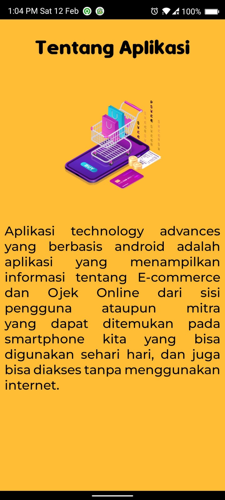
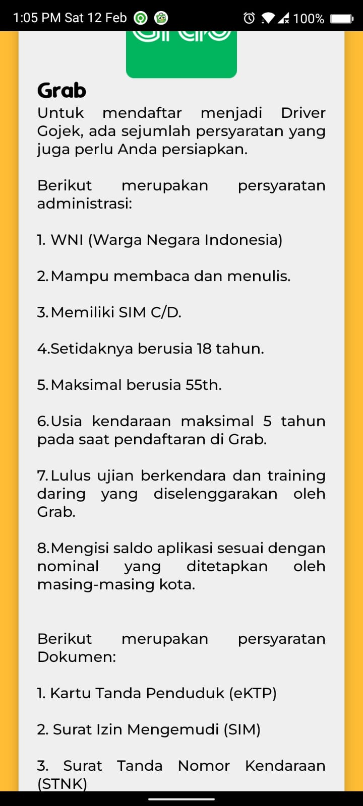
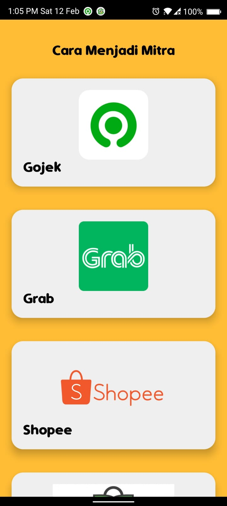

# Technology-Advances
Android App with simple cardview UI. This application contains information about online transportation in Indonesia, like Gojek and Grab. It also contains information about E - Commerce, especially in Indonesia. Developing Application using Java Language 

## About
Technology Advances Application based on Android is an application that show information about E-commerce and Online 
Transportation from the user or partner side that can be found on our smartphones that can be used every day, 
and can also be accessed without using the internet.

## Screenshot
The appearance of this application is very simple but does not reduce the usability of the application. Application contains CardView component with expand and collapse function.
- Main Menu

- About Menu

- Expand CardView

- Collapse CardView

## Requirement
- Lottie Depedency
- Min. SDK = 21
